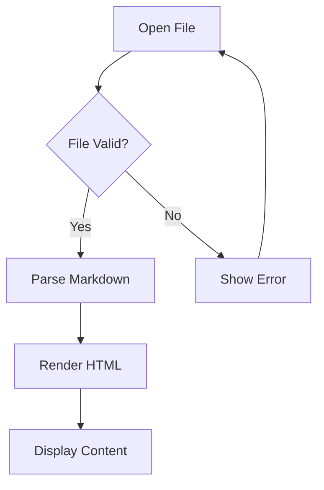
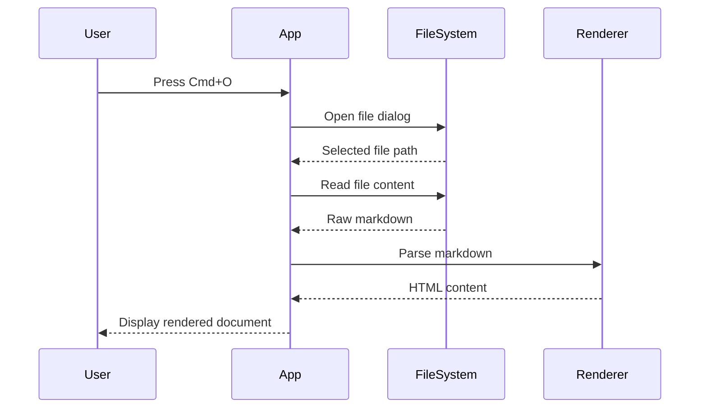
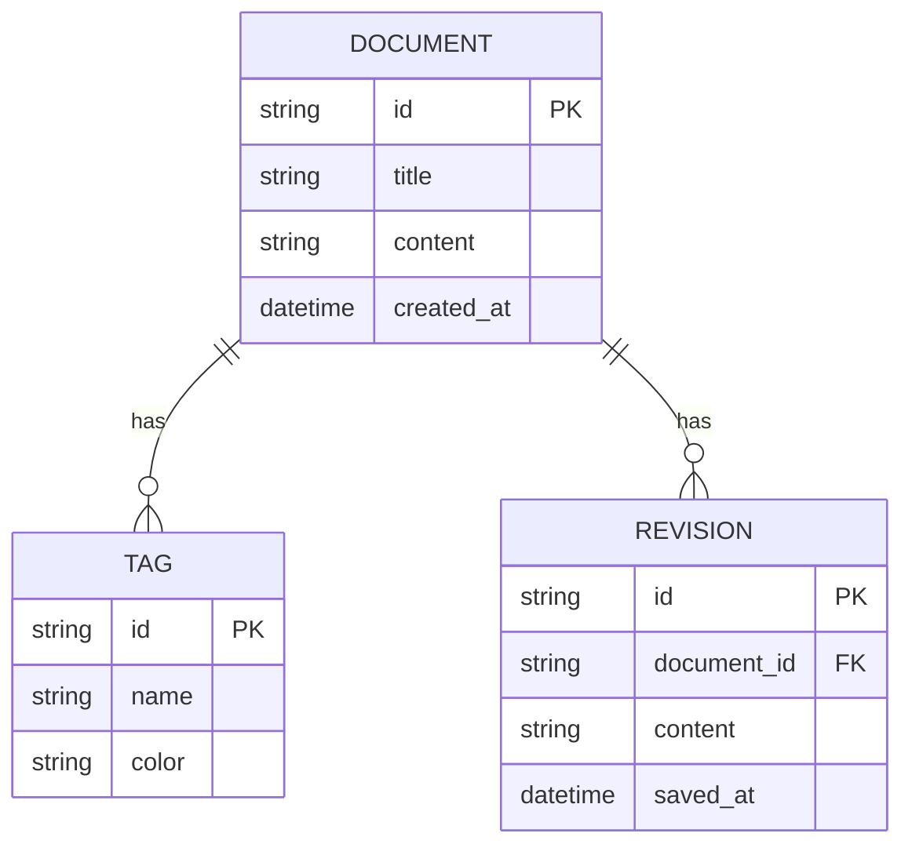
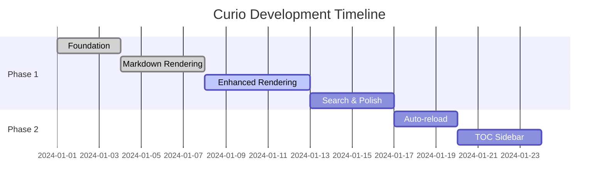

# Curio Test Document

Welcome to **Curio**, a beautiful markdown viewer for macOS. This document tests all the rendering features.

## Text Formatting

This is a paragraph with **bold text**, *italic text*, and ~~strikethrough text~~. You can also combine them: ***bold and italic***.

Here's some `inline code` within a sentence.

## Links

- [Curio on GitHub](https://github.com)
- Autolinked URL: https://example.com
- Email: contact@example.com

## Task List

- [x] Complete Phase 1A - Foundation
- [x] Complete Phase 1B - Markdown Rendering
- [x] Complete Phase 1C - Enhanced Rendering
- [ ] Phase 1D - Search & Polish

## Code Blocks with Syntax Highlighting

### JavaScript

```javascript
import { ref, computed } from 'vue'

function createCounter(initialValue = 0) {
  const count = ref(initialValue)

  const doubled = computed(() => count.value * 2)

  function increment() {
    count.value++
  }

  return { count, doubled, increment }
}

export default createCounter
```

### Python

```python
from dataclasses import dataclass
from typing import List, Optional

@dataclass
class Document:
    """Represents a markdown document."""
    title: str
    content: str
    tags: List[str] = None

    def word_count(self) -> int:
        return len(self.content.split())

    def preview(self, length: int = 100) -> str:
        return self.content[:length] + "..."

# Usage
doc = Document("Hello World", "This is my document content")
print(f"Words: {doc.word_count()}")
```

### Rust

```rust
use std::collections::HashMap;

#[derive(Debug, Clone)]
struct Document {
    title: String,
    content: String,
}

impl Document {
    fn new(title: &str, content: &str) -> Self {
        Self {
            title: title.to_string(),
            content: content.to_string(),
        }
    }

    fn word_count(&self) -> usize {
        self.content.split_whitespace().count()
    }
}

fn main() {
    let doc = Document::new("Hello", "World");
    println!("Count: {}", doc.word_count());
}
```

### SQL

```sql
SELECT
    users.name,
    COUNT(posts.id) AS post_count,
    MAX(posts.created_at) AS last_post
FROM users
LEFT JOIN posts ON posts.user_id = users.id
WHERE users.active = true
GROUP BY users.id
HAVING COUNT(posts.id) > 5
ORDER BY post_count DESC
LIMIT 10;
```

### Shell

```bash
#!/bin/bash

# Deploy script for Curio
set -euo pipefail

echo "Building Curio..."
pnpm build

echo "Running tests..."
pnpm test

echo "Creating release..."
pnpm tauri build

echo "✅ Done!"
```

## Mermaid Diagrams

### Flowchart



### Sequence Diagram



### Entity Relationship Diagram



### Gantt Chart



## Tables

| Feature | Status | Notes |
|---------|--------|-------|
| CommonMark | ✅ Done | Full support |
| GFM Tables | ✅ Done | With alignment |
| Task Lists | ✅ Done | Read-only |
| Syntax Highlighting | ✅ Done | 25+ languages |
| Mermaid Diagrams | ✅ Done | All types |

## Blockquotes

> "The best way to predict the future is to invent it."
> — Alan Kay

---

*If everything renders correctly, Phase 1C is complete!* 🎉
