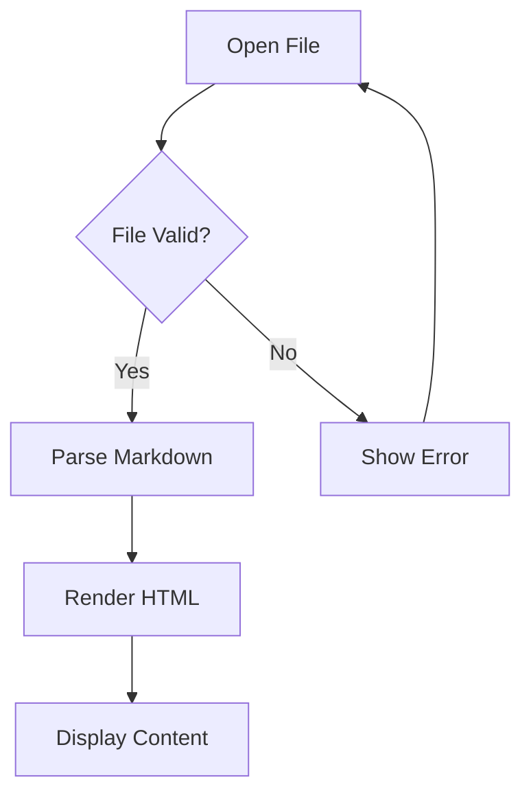
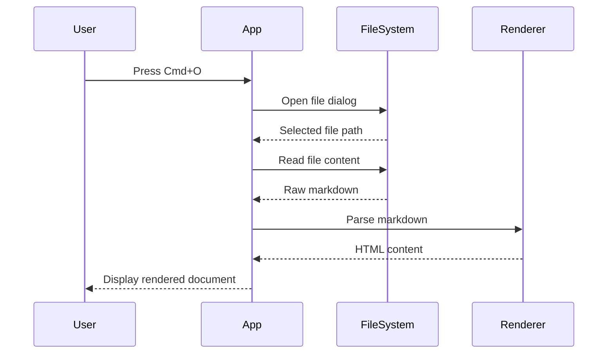
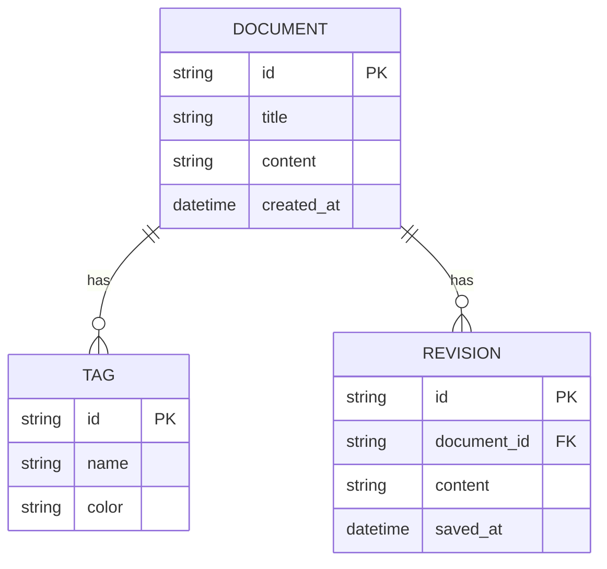
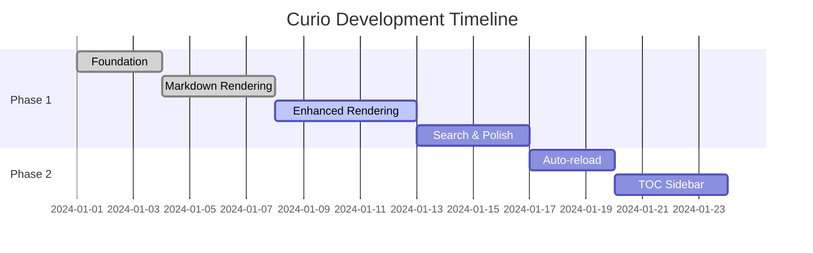

# Curio Test Document

Welcome to **Curio**, a fantastic markdown viewer for macOS. This document tests all the rendering features.

## Text Formatting

This is a paragraph with **bold text**, *italic text*, and ~~strikethrough text~~. You can also combine them: ***bold and italic***.

Here’s some inline code within a sentence.

## Links

- [Curio on GitHub](https://github.com)
- Autolinked URL: https://example.com
- Email: contact@example.com

## Task List

- [x] Complete Phase 1A - Foundation
- [x] Complete Phase 1B - Markdown Rendering
- [ ] Complete Phase 1C - Enhanced Rendering
- [ ] Phase 1D - Search & Polish

## Code Blocks with Syntax Highlighting

### JavaScript

```javascript
import { ref, computed } from 'vue'

function createCounter(initialValue = 0) {
  const count = ref(initialValue)

  const doubled = computed(() => count.value * 2)

  function increment() {
    count.value++
  }

  return { count, doubled, increment }
}

export default createCounter
```

### Python

```python
from dataclasses import dataclass
from typing import List, Optional

@dataclass
class Document:
    """Represents a markdown document."""
    title: str
    content: str
    tags: List[str] = None

    def word_count(self) -> int:
        return len(self.content.split())

    def preview(self, length: int = 100) -> str:
        return self.content[:length] + "..."

# Usage
doc = Document("Hello World", "This is my document content")
print(f"Words: {doc.word_count()}")
```

### Rust

```rust
use std::collections::HashMap;

#[derive(Debug, Clone)]
struct Document {
    title: String,
    content: String,
}

impl Document {
    fn new(title: &str, content: &str) -> Self {
        Self {
            title: title.to_string(),
            content: content.to_string(),
        }
    }

    fn word_count(&self) -> usize {
        self.content.split_whitespace().count()
    }
}

fn main() {
    let doc = Document::new("Hello", "World");
    println!("Count: {}", doc.word_count());
}
```

### SQL

```sql
SELECT
    users.name,
    COUNT(posts.id) AS post_count,
    MAX(posts.created_at) AS last_post
FROM users
LEFT JOIN posts ON posts.user_id = users.id
WHERE users.active = true
GROUP BY users.id
HAVING COUNT(posts.id) > 5
ORDER BY post_count DESC
LIMIT 10;
```

### Shell

```bash
#!/bin/bash

# Deploy script for Curio
set -euo pipefail

echo "Building Curio..."
pnpm build

echo "Running tests..."
pnpm test

echo "Creating release..."
pnpm tauri build

echo "✅ Done!"
```

## Mermaid Diagrams

### Flowchart


```mermaid
flowchart TD
    A[Open File] --> B{File Valid?}
    B -->|Yes| C[Parse Markdown]
    B -->|No| D[Show Error]
    C --> E[Render HTML]
    E --> F[Display Content]
    D --> A
```

### Sequence Diagram


```mermaid
sequenceDiagram
    participant User
    participant App
    participant FileSystem
    participant Renderer

    User->>App: Press Cmd+O
    App->>FileSystem: Open file dialog
    FileSystem-->>App: Selected file path
    App->>FileSystem: Read file content
    FileSystem-->>App: Raw markdown
    App->>Renderer: Parse markdown
    Renderer-->>App: HTML content
    App-->>User: Display rendered document
```

### Entity Relationship Diagram


```mermaid
erDiagram
    DOCUMENT ||--o{ TAG : has
    DOCUMENT {
        string id PK
        string title
        string content
        datetime created_at
    }
    TAG {
        string id PK
        string name
        string color
    }
    DOCUMENT ||--o{ REVISION : has
    REVISION {
        string id PK
        string document_id FK
        string content
        datetime saved_at
    }
```

### Gantt Chart


```mermaid
gantt
    title Curio Development Timeline
    dateFormat  YYYY-MM-DD
    section Phase 1
    Foundation          :done,    p1a, 2024-01-01, 3d
    Markdown Rendering  :done,    p1b, after p1a, 4d
    Enhanced Rendering  :active,  p1c, after p1b, 5d
    Search & Polish     :         p1d, after p1c, 4d
    section Phase 2
    Auto-reload         :         p2a, after p1d, 3d
    TOC Sidebar         :         p2b, after p2a, 4d
```

## Tables

| Feature | Status | Notes |
|---------|--------|-------|
| CommonMark | ✅ Done | Full support |
| GFM Tables | ✅ Done | With alignment |
| Task Lists | ✅ Done | Read-only |
| Syntax Highlighting | ✅ Done | 25+ languages |
| Mermaid Diagrams | ✅ Done | All types |

## Blockquotes

> "The best way to predict the future is to invent it."
> — Alan Kay

---

## Some test text

Lorem ipsum dolor sit amet, consectetur adipiscing elit. Sed elementum bibendum lorem non sodales. Nam sit amet metus eget ante molestie fringilla. Fusce lacinia varius dui quis malesuada. Quisque consequat leo id orci tristique pellentesque. Integer aliquam dignissim convallis. Pellentesque non dapibus enim, quis consectetur mi. Mauris tincidunt ipsum ut est scelerisque, sed accumsan justo imperdiet. Proin elementum, neque eu interdum feugiat, risus augue finibus eros, aliquet porttitor nulla lacus in justo. Morbi gravida id est quis malesuada. Pellentesque ut orci vel augue dapibus aliquam nec commodo tortor. Nullam urna urna, cursus non ipsum vel, laoreet scelerisque odio. Nulla at ex congue, sagittis diam vitae, porttitor nulla. Donec eget dolor tortor. Mauris dapibus ligula eget neque luctus tincidunt. Morbi a cursus sem. Aenean ac tellus id sem tincidunt accumsan eu eu tortor.

Aliquam dictum laoreet ante. Nullam viverra lectus in libero vulputate, et lacinia nunc pretium. Morbi convallis augue non erat egestas, id porta justo imperdiet. Nulla at accumsan nisl. Praesent nisl erat, vulputate vel justo id, finibus dignissim mauris. Donec vehicula ante ut urna dignissim mollis. Proin mollis massa sed nisi laoreet, non varius orci tincidunt. Pellentesque habitant morbi tristique senectus et netus et malesuada fames ac turpis egestas. Etiam vel eros posuere lacus mattis ultricies in ac est.

*If everything renders correctly, Phase 1C is complete!* 🎉
