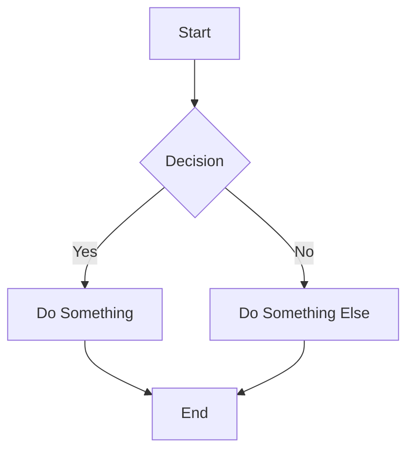

# Mermaid Test

Here's a simple flowchart:

```mermaid
graph TD
    A[Start] --> B{Decision}
    B -->|Yes| C[Do Something]
    B -->|No| D[Do Something Else]
    C --> E[End]
    D --> E
```

And some text after the diagram.
